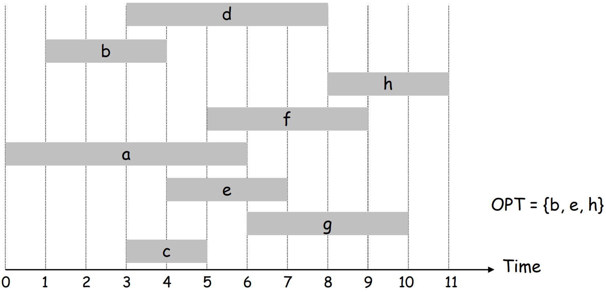
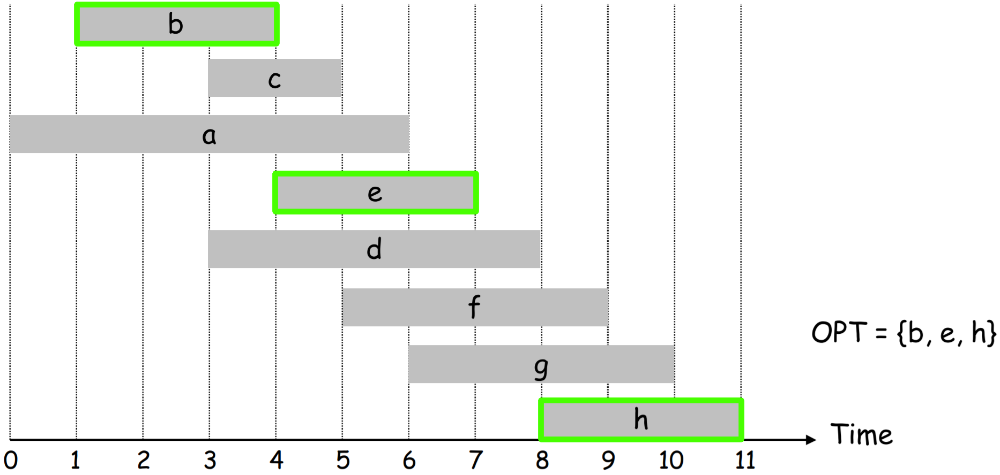
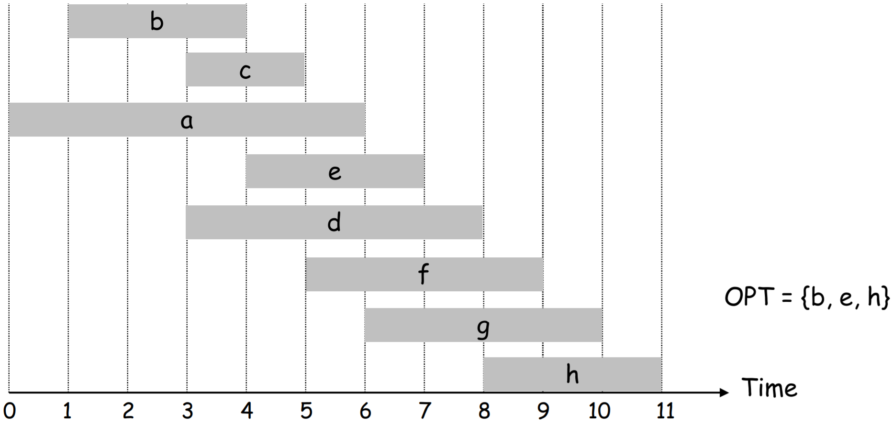
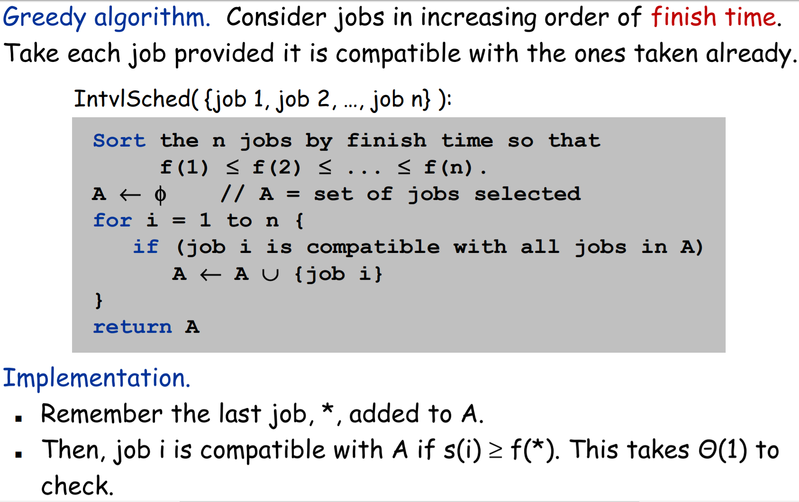

# Interval Scheduling
Greedy Algorithm to find the **maximum number** of mutually compatible jobs

## Problem Statement
- Job j starts at s(j) and finishes at f(j)
- 2 jobs are **compatible** if they do not overlap (2nd job starts after or at the same time as the 1st one finishes)
- **Goal: find the maximum number of mutually compatible jobs**
- Example: 8 jobs {a, b, c, d, e, f, g, h}

### Optimal = {b, e, h}

## Algorithm
**Consider jobs in ascending order of finish time f(j)**

### Sorted Jobs

### Pseudocode

## Runtime
Sorting O(n log(n)) + for-loop Θ(n)  
**O(n log(n))**

## References
- [Kevin Wayne Slides](https://www.cs.princeton.edu/~wayne/kleinberg-tardos/pearson/04GreedyAlgorithms-2x2.pdf)
- [University of Washington Slides](https://courses.cs.washington.edu/courses/cse421/07su/slides/04greed-4up.pdf)
- [T. M. Murali Slides](http://courses.cs.vt.edu/cs5114/spring2009/lectures/lecture04-greedy-scheduling.pdf)
- [Carl Kingsford Slides](https://www.cs.umd.edu/class/fall2009/cmsc451/lectures/Lec04-interval.pdf)
- [Violetta lonati Slides](http://lonati.di.unimi.it/algo/0910/lab/kowalski6.pdf)
